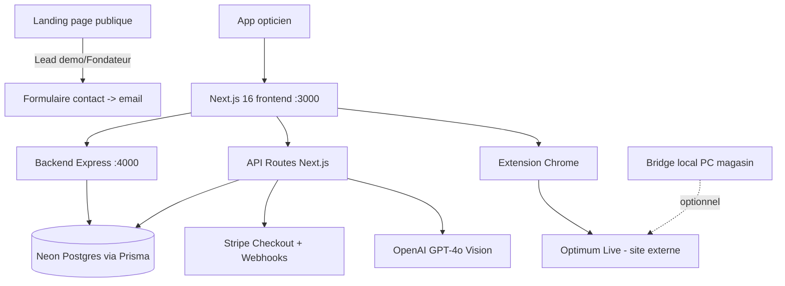

# Synchronisation OptiPilot ↔ Optimum Live (mode cloud, sans SQL Server)

Ce document décrit le circuit technique utilisé par les magasins qui n'ont **pas de SQL Server local** (Optimum Live pur, cloud) — c'est le cas de la majorité des magasins actuels.

## Le circuit complet

1. **Tablette (client ou opticien)** — sur la page `/devis`, clique sur **"Envoyer vers Optimum"**.
   → Appelle `envoyerViaRelais()` qui POST sur `${BACKEND}/api/bridge/devis-push` (backend Express, Render).
   → Crée une ligne `DevisPending` en base (statut `pending`).

2. **Extension Chrome** (installée sur le PC du magasin) — poll `/api/bridge/devis-pull` toutes les **~15 secondes** (`chrome.alarms`, alarm `pollDevis` dans `extension/background.js`).
   → Si un devis en attente est trouvé, cherche un onglet Chrome déjà ouvert sur `livebyoptimum.com` (`chrome.tabs.query`).
   → Envoie le payload au content script (`devis-inject.js`) qui affiche un **panneau flottant** sur la page Optimum Live avec les infos du devis (verrier, gamme, prix monture/verres, remboursements estimés).
   → Acquitte le devis via `/api/bridge/devis-ack` (statut `done`).

3. **Opticien** — lit le panneau OptiPilot affiché à côté du formulaire Optimum Live, et **saisit lui-même** le devis dans Optimum Live (pas de remplissage automatique des champs — Optimum calcule ses propres prix).

4. **Détection automatique du RAC réel** — `devis-inject.js` utilise un `MutationObserver` qui surveille en continu les cellules de résultat RAC d'Optimum Live :
   - `td.total_ro` (remboursement Sécu)
   - `td.total_rc_1` (remboursement mutuelle RC1)
   - `td.total_rac` (reste à charge final)

   Dès que ces valeurs changent (après calcul TP dans Optimum), un debounce de 2s se déclenche puis POST automatiquement sur `${BACKEND}/api/rac-result`.

5. **Backend** — reçoit le RAC réel, l'enregistre, puis émet un événement **Socket.io** `rac-confirme` dans la room du magasin (`io.to(magasinId).emit(...)`).

6. **Tablette** — toujours connectée en Socket.io sur `/devis` (rejoint la room `magasinId` au montage de la page), reçoit l'événement `rac-confirme` en temps réel → met à jour l'affichage avec le **RAC réel confirmé** (statut passe de "en attente de cotation" à "cotation reçue").

## ⚠️ Prérequis à vérifier AVANT un test ou un rendez-vous client

1. **Un onglet Optimum Live doit déjà être ouvert dans Chrome sur le PC du magasin** au moment où la tablette envoie le devis.
   L'extension ne cherche que parmi les onglets déjà ouverts — elle n'en ouvre pas un nouveau pour ce flux (contrairement au bouton "Ouvrir dans Optimum" de la tablette, qui lui ouvre un nouvel onglet directement).

2. **L'extension doit être connectée** (token OptiPilot stocké dans `chrome.storage.local`) sur ce PC.
   Se logger au moins une fois dans l'app OptiPilot depuis ce poste pour synchroniser le token (`token-sync.js`).

3. **Les sélecteurs CSS** utilisés pour lire le RAC calculé par Optimum Live ont été relevés le **27/07/2026** (`extension/devis-inject.js`, objet `SELECTORS`).
   Si l'interface d'Optimum Live a changé depuis, la détection automatique du RAC peut ne plus fonctionner — le devis resterait alors bloqué sur "en attente de cotation" (pas d'erreur bloquante, juste pas de mise à jour automatique). Dans ce cas, le RAC doit être vérifié/saisi manuellement.

4. **Backend Render** (`optipilot-backend.onrender.com`) doit être actif — plan payant depuis le 13/08/2026, plus de cold start à surveiller.

## Recommandation

Faire un **essai à blanc** (devis test, sans vrai client) avant un rendez-vous réel pour valider les 3 premiers points :
1. Envoyer un devis test depuis la tablette
2. Vérifier que le panneau OptiPilot apparaît bien sur l'onglet Optimum Live du PC
3. Simuler un devis dans Optimum Live et vérifier que le RAC réel remonte automatiquement sur la tablette

## Fichiers concernés

- `src/app/devis/page.tsx` — fonctions `envoyerViaRelais()`, `envoyerVersOptimum()` (variante bridge PC/SQL local), écoute Socket.io `rac-confirme`
- `backend/server.ts` — routes `/api/bridge/devis-push`, `/api/bridge/devis-pull`, `/api/bridge/devis-ack`, `/api/rac-result`, émission Socket.io
- `extension/background.js` — polling `pollDevisPending()`, alarm `pollDevis` (~15s)
- `extension/devis-inject.js` — panneau flottant, `SELECTORS`, `MutationObserver`, `envoyerRACiPad()`
- `optipilot-extension/` — miroir de `extension/` à synchroniser après toute modification (voir mémoire repo)

---

# Architecture générale du site OptiPilot

## Vue d'ensemble

## Frontend
- **Next.js 16** (App Router, React) — hébergé sur **Vercel**
- **Tailwind CSS** + **Framer Motion** pour les animations
- Deux thèmes coexistent : landing page publique ("Optical Chic", clair/serif) vs app interne ("page-bg", sombre/violet)
- Dossier : `src/app/` (pages), `src/components/` (composants partagés), `src/lib/` (logique métier), `src/data/` (données statiques montures)

## Backend
- **Express.js** séparé (`backend/server.ts`), hébergé sur **Render** (plan payant, pas de cold start) — gère l'essentiel du métier : auth JWT, clients, devis, ordonnances, stats, offre ambassadeur, relais bridge Optimum, Socket.io temps réel
- **API Routes Next.js** (`src/app/api/`) — utilisées spécifiquement pour Stripe (checkout/webhook), scan IA (ordonnance/mutuelle), formulaire de contact, analyse visage

## Base de données
- **PostgreSQL** hébergé sur **Neon** (cloud, région Europe/Frankfurt), accès via **Prisma ORM**
- Schéma : `prisma/schema.prisma`
- Modèles clés : `Magasin`, `Utilisateur`, `Client`, `Devis`, `DevisPending`, `ClientPending`, `ClientSearchRequest`, `ConfigGlobale`, `ConfigTarif`
- ⚠️ Toujours utiliser `npx prisma db push` pour les évolutions de schéma, jamais `npx prisma migrate dev` (drift déjà présent, reset destructeur sinon)

## Intelligence artificielle
- **OpenAI GPT-4o Vision** pour le scan d'ordonnance et de carte mutuelle (extraction de données depuis une photo)
- Logique de recommandation de verres (`src/lib/recommandation.ts`) et conseiller IA vente (`src/lib/conseillerOpticien.ts`) — règles métier maison, pas de modèle IA externe pour ces parties

## Paiement
- **Stripe** (mode live) — abonnements avec 1 mois offert (`trial_period_days: 30` pour les nouveaux clients), 2 plans : Fondateur (149€/mois à vie, 10 places) et Régulier (199€/mois)
- Fichiers : `src/app/api/stripe/checkout/route.ts`, `src/app/api/stripe/webhook/route.ts`, `src/app/abonnement/page.tsx`

## Intégration Optimum Live
- **Extension Chrome** (`extension/`, manifest v3) : pré-remplit les formulaires sur `livebyoptimum.com`, recherche de clients existants, transfert et cotation de devis (voir première partie de ce document)
- **Bridge local optionnel** (`bridge/`, Node.js/Express, port 5174) : pour les magasins avec SQL Server local — sinon tout passe par le relais cloud (backend + extension)
- ⚠️ Dossier dupliqué `optipilot-extension/` à la racine du workspace = miroir de `optipilot/extension/`, à resynchroniser manuellement après chaque modification de l'extension

## Authentification & sécurité
- JWT (durée 7 jours), mot de passe hashé (bcrypt)
- Code PIN à 4 chiffres (localStorage/sessionStorage) pour le verrouillage tablette côté client — voir `src/lib/opticianAuth.ts` et `src/components/OpticianGuard.tsx`
- Chaque `Magasin` a ses propres `Utilisateur`s, `Client`s et `Devis` — isolation stricte par `magasinId`

## Langages et principales dépendances
- **TypeScript** (frontend + backend + bridge)
- **React 19** / **Next.js 16**
- **Node.js** / **Express** (backend + bridge)
- **Prisma** (ORM)
- **Tailwind CSS**, **Framer Motion**
- **Socket.io** (temps réel devis ↔ tablette)
- **Stripe SDK**, **OpenAI SDK**, **Nodemailer** (emails), **html2pdf.js** (export PDF)
- **JavaScript** (extension Chrome — manifest v3, service worker)

